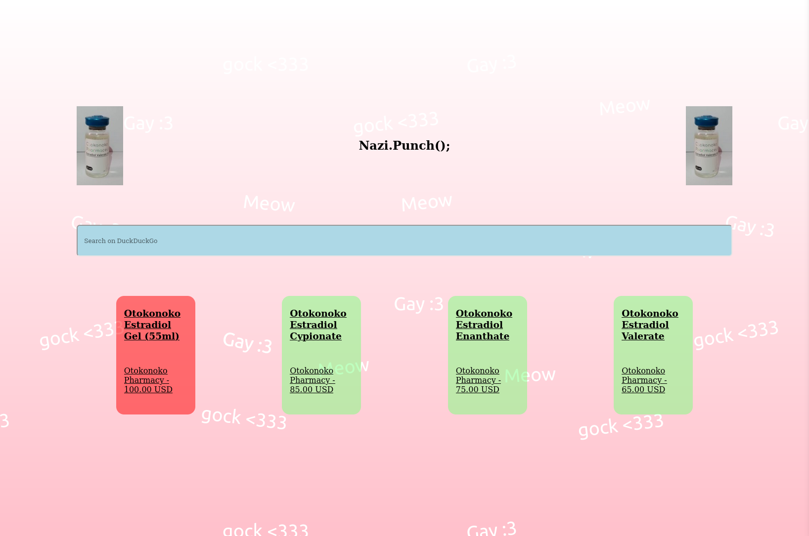

# trans new tab page

I am using the api of [diyhrt.market](https://diyhrt.market/api/) to get the current stats data of estrogen stocks.



## Installation

To install the new tab page you can use `go install`

```sh
go install gitea.elara.ws/Hazel/transfem-startpage
```

Then you can run the program `transfem-startpage`

```sh
transfem-startpage help
```

To configure this new tab page as website, you can install the firefox extension [New Tab Override](https://addons.mozilla.org/en-US/firefox/addon/new-tab-override/). Then just configure the url as `http://127.0.0.1:{port}/`. The default port should be `5500` but it will also print it out when starting the server. Make sure to check the box `Set focus to the web page instead of the address bar` in the extension settings, because the new tab page auto focuses the search bar.

## CLI

```sh
transfem-startpage {program} {...args}
```

program | args | description
---|---|---
`help` | `program:optional` | get more information on how the cli or one program works
`start` | `profile:optional` | start the webserver for a certain profile
`cache` | `action:emum(clear;clean)` | so something with the cache

## Config and Profiles

This tool works with profiles. The default profile is `default`. If you want to load another profile just write it as command line arg after the command. To write a config File you can create the files here:

- `{profile}.toml`
- `.{profile}.toml`
- `~/.config/startpage/{profile}.toml`

If you have the server installed, you can start it with any profile by just doing:

```sh
transfem-startpage {profile}
```

## development

1. Install [air](https://github.com/air-verse/air)
2. Run air

```sh
air dev
```

## TODO

- WRITE DOCUMENTATION ON HOW THE CONFIG WORKS
- ~~implement templating for every one of the frontend files~~
- implement functionality to clear and clean cache
- host this website on a demo page
- implement autocomplete with a nice go backend and fast communication. Since it all runs locally nobody should have privacy concerns NEEDS TO BE ABLE TO TOGGLED OFF FOR DEMO PAGE
